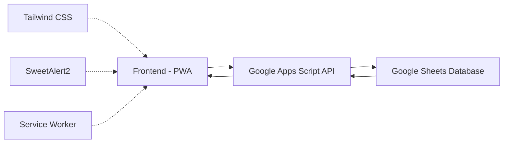

# 🚚 Mangpong Trading PWA

Progressive Web App for Mangpong Trading Delivery (แมงป่อง เทรดดิ้ง)

[](LICENSE)
[](https://web.dev/progressive-web-apps/)
[](https://developer.mozilla.org/en-US/docs/Web/JavaScript)

## 📋 Table of Contents
- [Overview](#overview)
- [Features](#features)
- [Technology Stack](#technology-stack)
- [Architecture](#architecture)
- [Project Structure](#project-structure)
- [Getting Started](#getting-started)
- [Development](#development)
- [Deployment](#deployment)
- [User Roles](#user-roles)
- [Salary System](#salary-system)
- [Error Handling](#error-handling)
- [Context Engineering](#context-engineering)
- [Contributing](#contributing)
- [License](#license)

## 🌟 Overview

Mangpong Trading PWA is a modern Progressive Web Application designed to streamline delivery operations for Mangpong Trading company. The application allows messengers to record delivery jobs, track job statuses, and manage their earnings, while providing administrators and owners with comprehensive reporting and analytics capabilities.

The application is built with offline support capabilities, allowing users to continue working even when internet connectivity is intermittent.

## 🚀 Features

### Messenger (7 features)
1. **LINE Login/Register** - Secure authentication via LINE
2. **Dashboard** - Home screen with job statistics
3. **New Job Recording** - Create and save delivery jobs
4. **Job History** - View past jobs with filtering capabilities
5. **Edit Jobs** - Modify existing job details
6. **Image Upload** - Attach images to job records
7. **Offline Support** - Work without internet connection

### Employee (Admin) (5 features)
1. **Data View** - Access job data from Google Sheets
2. **Dashboard** - Company/employee selection dashboard
3. **Monthly Reports** - Generate comprehensive reports
4. **PDF Export** - Export billing and payroll data to PDF
5. **Auto Filtering** - Automatic query/filter to separate sheets

### Owner (4 features)
1. **Monthly Dashboard** - Overall monthly business dashboard
2. **Company Summary** - Company/employee performance summary
3. **Payroll Approval** - Review and approve payroll calculations
4. **Bill Verification** - Verify billing accuracy

## ⚙️ Technology Stack

### Frontend
- **HTML5, CSS3, JavaScript (ES6+)** - Core technologies
- **Tailwind CSS** - Utility-first CSS framework
- **SweetAlert2** - Beautiful alert dialogs
- **Prompt Font** - Google Fonts for Thai language support
- **PWA Features** - Service workers, manifest, offline support

### Backend
- **Google Apps Script** - Serverless backend platform
- **Google Sheets** - Database for storing job records

### Development Tools
- **Vite** - Fast build tool
- **ESLint** - Code linting
- **Jest** - Testing framework
- **Prettier** - Code formatting

## 🏗️ Architecture



### Data Flow
1. User inputs data through the UI
2. Data is sent to Google Apps Script via API
3. Google Apps Script processes and saves data to Google Sheets
4. Data is retrieved back to the UI for display

### Offline Support
- **Service Worker** - Manages caching of assets
- **Request Queue** - Queues requests when offline
- **Local Storage** - Temporary data storage
- **Sync Mechanism** - Syncs data when connectivity is restored

## 📁 Project Structure

```
.
├── src/
│   ├── components/          # UI Components
│   │   ├── Header/          # Header component
│   │   ├── Dashboard/       # Dashboard component
│   │   ├── JobForm/         # Job Form component
│   │   └── index.js         # Components export
│   ├── hooks/               # Custom hooks
│   │   ├── useJobForm.js    # Job Form hook
│   │   ├── useDashboard.js  # Dashboard hook
│   │   └── index.js         # Hooks export
│   ├── pages/               # Page components
│   │   ├── Messenger.js     # Messenger pages
│   │   ├── Admin.js         # Admin pages
│   │   ├── Owner.js         # Owner pages
│   │   └── index.js         # Pages export
│   ├── utils/               # Utility functions
│   │   ├── api/             # API utilities
│   │   ├── auth/            # Authentication utilities
│   │   ├── validation/      # Validation utilities
│   │   ├── storage.js       # Storage utilities
│   │   ├── navigation.js    # Navigation utilities
│   │   ├── date.js          # Date utilities
│   │   ├── formatting.js    # Formatting utilities
│   │   ├── app.js           # App initialization
│   │   └── index.js         # Utilities export
│   ├── constants/           # Constants
│   │   ├── companies.js     # Company constants
│   │   ├── statuses.js      # Status constants
│   │   ├── errors.js        # Error constants
│   │   └── index.js         # Constants export
│   ├── types/               # TypeScript types
│   │   ├── user.ts          # User types
│   │   ├── job.ts           # Job types
│   │   ├── api.ts           # API types
│   │   └── index.ts         # Types export
│   ├── styles/              # CSS/Tailwind styles
│   ├── assets/              # Images and assets
│   ├── main.js              # Main entry point (≤ 100 lines)
│   └── index.js             # Main export
├── context/                 # Project context files
│   ├── business/            # Business context
│   ├── technical/           # Technical context
│   ├── operational/         # Operational context
│   ├── user/                # User context
│   └── context.json         # Generated context
├── errors/                  # Error tracking
│   ├── error-log.json       # Error log
│   ├── recurring-errors.json # Recurring errors
│   └── error-solutions.md   # Error solutions guide
├── .vscode/                 # VSCode configuration
│   ├── settings.json        # VSCode settings
│   ├── tasks.json           # VSCode tasks
│   └── snippets/            # VSCode snippets
├── eslint-plugin-mangpong/  # Custom ESLint plugin
├── eslint.config.js         # ESLint configuration
├── index.html               # Main HTML file
├── edit.html                # Edit job HTML file
├── config.js                # Configuration
├── service-worker.js        # PWA service worker
├── manifest.json            # PWA manifest
├── package.json             # Project package info
└── README.md               # Project documentation
```

## 🚀 Getting Started

### Prerequisites
- Node.js (version 16 or higher)
- npm or yarn
- VS Code (recommended)

### Installation
1. Clone the repository:
```bash
git clone https://github.com/Ayou2529/mangpong-pwa.git
cd mangpong-pwa
```

2. Install dependencies:
```bash
npm install
```

### Running the Application
```bash
# Development server
npm run dev

# Build for production
npm run build

# Preview production build
npm run preview

# Run tests
npm run test

# Run tests in watch mode
npm run test:watch
```

## 🛠️ Development

### Code Quality
- ESLint is configured to warn when files exceed 500 lines
- Run `npm run lint` to check code quality
- Run `npm run lint:fix` to automatically fix some issues

### Snippets
The project includes custom VSCode snippets for faster development:
- `mangpong-component` - Create a new component
- `mangpong-hook` - Create a new hook
- `mangpong-utility` - Create a new utility function
- `mangpong-validation` - Create a new validation function
- `mangpong-interface` - Create a new TypeScript interface
- `mangpong-enum` - Create a new TypeScript enum

### File Size Limits
- Each file should not exceed 500 lines
- Main entry point (`main.js`) should not exceed 100 lines
- ESLint will warn when limits are exceeded

## ☁️ Deployment

The application is deployed to GitHub Pages using a custom deployment script:

```bash
npm run deploy
```

This command runs `deploy.js` which handles the deployment process to GitHub Pages.

## 👥 User Roles

### Messenger
Primary users who record and track delivery jobs. They have access to:
- Job creation and editing
- Job history with filtering
- Offline job recording
- Earnings calculation

### Employee (Admin)
Administrative users with access to:
- All job data from Google Sheets
- Reporting dashboard
- Monthly reports generation
- PDF export capabilities

### Owner
Business owners with access to:
- Overall business analytics
- Financial performance tracking
- Employee productivity monitoring
- Payroll and billing verification

## 💰 Salary System

The application implements a 70/30 commission split system:

- **Commission Split**: 70% to Messenger, 30% to Company
- **Base Salary**: 15,000 THB
- **Social Security**: 5% of earnings (maximum 750 THB)
- **Special Allowance**: Difference when 70% of earnings ≥ 15,000 THB
- **Deductions**: Difference when 70% of earnings < 15,000 THB

### Calculation Process
1. System retrieves completed jobs for the month
2. Calculates total service amount
3. Computes 70% commission for Messenger
4. Computes 30% share for Company
5. Checks against base salary of 15,000 THB
6. Calculates social security (5%, max 750 THB)
7. Computes special allowance or deductions based on conditions

## 🚨 Error Handling

The project includes comprehensive error tracking and handling:

### Error Log
Located at `errors/error-log.json`, this file tracks all errors with:
- Error ID and timestamp
- Error type and message
- File and line number
- Status (unresolved, resolved, recurring)
- Priority level
- Context and solutions

### Error Solutions Guide
Detailed solutions for common errors are documented in `errors/error-solutions.md`:
- Network errors
- UI rendering issues
- CORS errors
- Reference errors
- Service worker errors
- Storage errors
- Authentication errors

### Recurring Errors
Patterns of recurring errors are tracked in `errors/recurring-errors.json` to identify systemic issues.

## 🧠 Context Engineering

The project implements a comprehensive context engineering system to maintain consistency between business requirements, technical implementation, and user experience.

### Context Structure
- **Business Context**: Domain, roles, processes
- **Technical Context**: Architecture, components, data model
- **Operational Context**: Workflows, policies
- **User Context**: Personas, journeys

### Context Files
Context information is organized in the `context/` directory:
- `business/` - Business domain information
- `technical/` - Technical architecture details
- `operational/` - Operational workflows and policies
- `user/` - User personas and journeys

### Context Engineering Tools
The project includes a comprehensive Context Engineering CLI:

```bash
# Validate context files
npm run context:validate

# Generate visualization diagrams
npm run context:visualize

# Update all context files
npm run context:update

# Watch for changes
npm run context:watch

# Search context files
npm run context:search <query>
```

### Context Generation
Run the context generation script to update context files:
```bash
node context/generate-context.js
```

This generates:
- `context.json` - Machine-readable context
- `context-summary.md` - Human-readable summary with diagrams

For more details about the Context Engineering system, see [CONTEXT_ENGINEERING.md](context/CONTEXT_ENGINEERING.md)

## 🤝 Contributing

As a solo developer project, contributions are primarily managed by the project owner. However, suggestions and feedback are welcome.

### Development Guidelines
1. Follow the single responsibility principle
2. Keep files under 500 lines
3. Use ES6 modules for import/export
4. Maintain consistent code style
5. Write tests for new functionality
6. Document complex logic

### Git Workflow
1. Create feature branches from main
2. Make small, focused commits
3. Write descriptive commit messages
4. Submit pull requests for review
5. Ensure all tests pass before merging

## 📄 License

This project is licensed under the ISC License - see the [LICENSE](LICENSE) file for details.

## 📞 Support

For support, please contact the project maintainer or refer to the documentation in the `context/` directory.

---

*Built with ❤️ for Mangpong Trading*