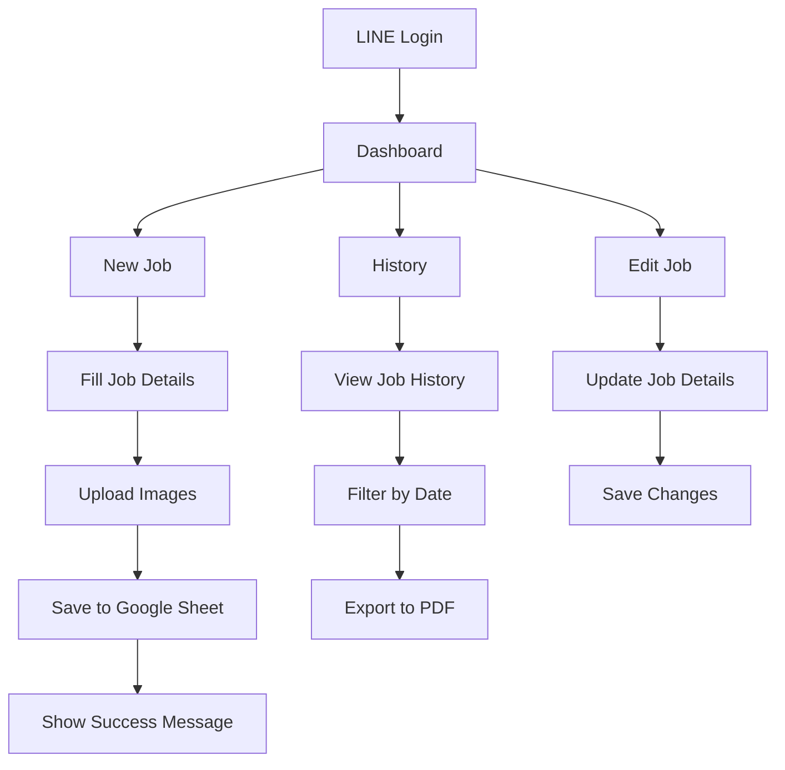
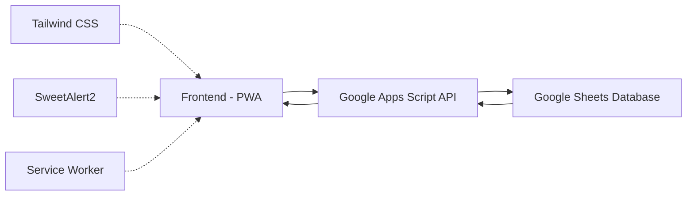

# Project Context Summary

## Basic Information
- **Project Name**: mangpong-pwa
- **Version**: 1.0.0
- **Description**: Progressive Web App for Mangpong Trading Delivery (แมงป่อง เทรดดิ้ง)

## Technologies
- **Frontend**: HTML5, CSS3, JavaScript (ES6+)
- **UI Framework**: Tailwind CSS
- **Backend**: Google Apps Script
- **Database**: Google Sheets

## Google Apps Script
- **URL**: https://script.google.com/macros/s/AKfycbxZIMrFlOm3IzVSM-PqmgA91v-t48szqLLk9HD0IKdW9FBd3BFJ7SE9Eci6NEBcNa9v/exec
- **Spreadsheet ID**: 1fcq5P7vm3IxtJMDS9BLDwO8B14hFmmDdK257GHyoM

## Roles
- **Messenger**: 7 features
- **Employee (Admin)**: 5 features
- **Owner**: 4 features

## Salary System
- **Split**: 70/30 (Messenger gets 70%, Company gets 30%)
- **Base Salary**: 15,000 THB

## User Flow

## System Architecture

## Recent Chat Logs (Last 3)
2025-09-10 09:15:23
**User**: ผมต้องการให้หน้า history แสดงผลตามวันที่เลือก และสามารถ export เป็น PDF ได้
**Developer**: เข้าใจครับ ผมจะเพิ่มฟีเจอร์ filter ตามวันที่ในหน้า history และเพิ่มปุ่ม export เป็น PDF โดยใช้ jsPDF

2025-09-11 14:30:45
**User**: ระบบ login ยังไม่ work บนมือถือ android บางรุ่น
**Developer**: ปัญหานี้เกิดจาก service worker ไม่โหลด properly ในบาง browser ผมจะตรวจสอบและแก้ไขโดยการเพิ่ม fallback mechanism

2025-09-12 16:45:12
**User**: อยากให้เพิ่ม feature คำนวณค่าคอมมิชชั่นอัตโนมัติในหน้า payroll
**Developer**: ได้ครับ ผมจะสร้าง function คำนวณค่าคอมมิชชั่นตามสูตร 70/30 และแสดงผลในตาราง payroll พร้อมปุ่ม export

## Unresolved Errors
- ERR001: Network Error - Failed to fetch data from Google Apps Script API (main.js:125)
- ERR002: UI Rendering Error - Modal dialog not displaying correctly on mobile devices (edit.html:87)

## Recurring Errors
No recurring errors

## Context Engineering
- **Version**: 2.0
- **Structure**: Business, Technical, Operational, User contexts
- **Last Updated**: 2025-09-15T10:30:00Z
- **Context Version**: 2.0.0

## Business Context
# Business Domain

## ภาพรวม
Mangpong Trading PWA เป็นแอปพลิเคชัน Progressive Web App ที่ออกแบบมาเพื่อบริษัท Mangpong Trading เพื่อปรับปรุงกระบวนการทำงานจัดส่ง

## โดเมนธุรกิจ
- **Courier and delivery services**: ให้บริการรับ-ส่งเอกสารและสินค้า
- **Job tracking**: การติดตามสถานะงานจัดส่ง
- **Commission system**: ระบบค่าคอมมิชชั่นตามสัดส่วน 70/30
- **Payroll management**: การจัดการเงินเดือนและค่าตอบแทน

## กฎทางธุรกิจ (Business Rules)
1. **Commission Split**: 70/30 (Messenger ได้ 70%, บริษัทได้ 30%)
2. **Base Salary**: เงินเดือนฐาน 15,000 บาท
3. **Social Security**: หัก 5% ของรายได้ (สูงสุด 750 บาท)
4. **Special Allowance**: กรณี 70% ของรายได้ ≥ 15,000 บาท จะได้รับเบี้ยเลี้ยงพิเศษ
5. **Deductions**: กรณี 70% ของรายได้ < 15,000 บาท จะมีการหักเงิน

## กระบวนการทางธุรกิจ
1. ผู้ส่งของสร้างงานจัดส่งใหม่
2. ระบบบันทึกข้อมูลงาน
3. ระบบคำนวณค่าคอมมิชชั่นตามสูตร
4. ระบบติดตามสถานะงาน
5. ระบบจัดการเงินเดือนประจำเดือน

## Technical Context
# Technical Architecture

## สถาปัตยกรรมระบบ

### Frontend Architecture
- **Core Technologies**: HTML5, CSS3, JavaScript (ES6+)
- **UI Framework**: Tailwind CSS
- **PWA Features**: Service workers, Web App Manifest, Offline Support
- **Libraries**: 
  - SweetAlert2 สำหรับการแจ้งเตือน
  - jsPDF สำหรับการส่งออก PDF
  - Google Fonts (Prompt)

### Backend Architecture
- **Backend**: Google Apps Script
- **Database**: Google Sheets
- **API Endpoint**: https://script.google.com/macros/s/AKfycbxZIMrFlOm3IzVSM-PqmgA91v-t48szqLLk9HD0IKdW9FBd3BFJ7SE9Eci6NEBcNa9v/exec

### Data Flow
1. ผู้ใช้ป้อนข้อมูลผ่าน UI
2. ข้อมูลถูกส่งไปยัง Google Apps Script ผ่าน API
3. Google Apps Script ประมวลผลและบันทึกข้อมูลลง Google Sheets
4. ข้อมูลถูกดึงกลับมาแสดงใน UI

### Offline Support
- **Service Worker**: จัดการ caching ของ assets
- **Request Queue**: จัดคิวคำขอเมื่อไม่มีการเชื่อมต่อ
- **Local Storage**: จัดเก็บข้อมูลชั่วคราว
- **Sync Mechanism**: ซิงค์ข้อมูลเมื่อมีการเชื่อมต่ออีกครั้ง