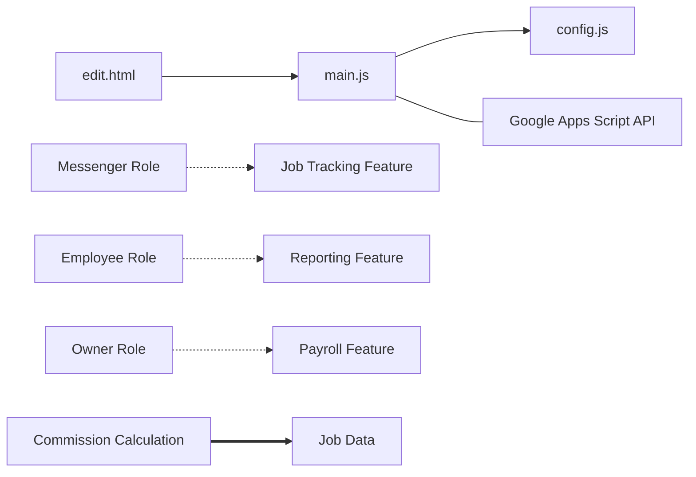

# Dependencies Diagram

This diagram shows the dependencies between different components, features, and data elements in the project.

## Legend
- **Solid Arrow** --> Component dependencies
- **Dotted Arrow** -.-> Feature dependencies
- **Bold Arrow** ==> Data dependencies
- **Dash Arrow** --- External dependencies

## Dependencies List
- **main.js → config.js** (component): Main application file depends on configuration settings
- **main.js → Google Apps Script API** (external): Main application depends on backend API for data
- **edit.html → main.js** (component): Edit page depends on main application logic
- **Messenger Role → Job Tracking Feature** (feature): Messenger role depends on job tracking functionality
- **Employee Role → Reporting Feature** (feature): Employee role depends on reporting functionality
- **Owner Role → Payroll Feature** (feature): Owner role depends on payroll functionality
- **Commission Calculation → Job Data** (data): Commission calculation depends on accurate job data
- **Payroll Processing → Commission Calculation** (process): Payroll processing depends on commission calculation results

## Dependency Types
- **component**: Dependencies between software components
- **feature**: Dependencies between features
- **data**: Dependencies between data elements
- **process**: Dependencies between business processes
- **external**: Dependencies on external systems
- **team**: Dependencies between team members or teams
