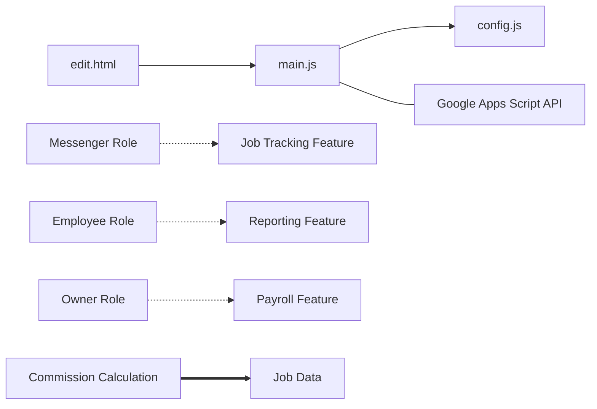

# Context Visualization Report

This report provides visual representations of the project's context and dependencies.

## Table of Contents
1. [Context Relationship Diagram](#context-relationship-diagram)
2. [Dependencies Diagram](#dependencies-diagram)

## Context Relationship Diagram

```mermaid
graph TD
    business_domain[Business Domain\n(Business)]
    business_roles[Business Roles\n(Business)]
    business_processes[Business Processes\n(Business)]
    technical_architecture[Technical Architecture\n(Technical)]
    technical_components[Technical Components\n(Technical)]
    technical_data[Data Model\n(Technical)]
    operational_workflows[Operational Workflows\n(Operational)]
    operational_policies[Operational Policies\n(Operational)]
    user_personas[User Personas\n(User)]
    user_journeys[User Journeys\n(User)]

    business_domain -- influences --> business_roles
    business_domain -- contains --> business_processes
    business_roles -- maps to --> user_personas
    business_processes -- implements --> operational_workflows
    technical_architecture -- contains --> technical_components
    technical_components -- uses --> technical_data
    user_journeys -- follows --> operational_workflows
    operational_policies -- governs --> business_processes

```

## Dependencies Diagram



---
*Generated on 2025-09-16T08:30:10.651Z*
